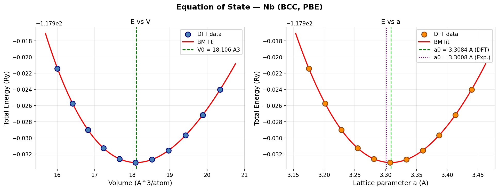
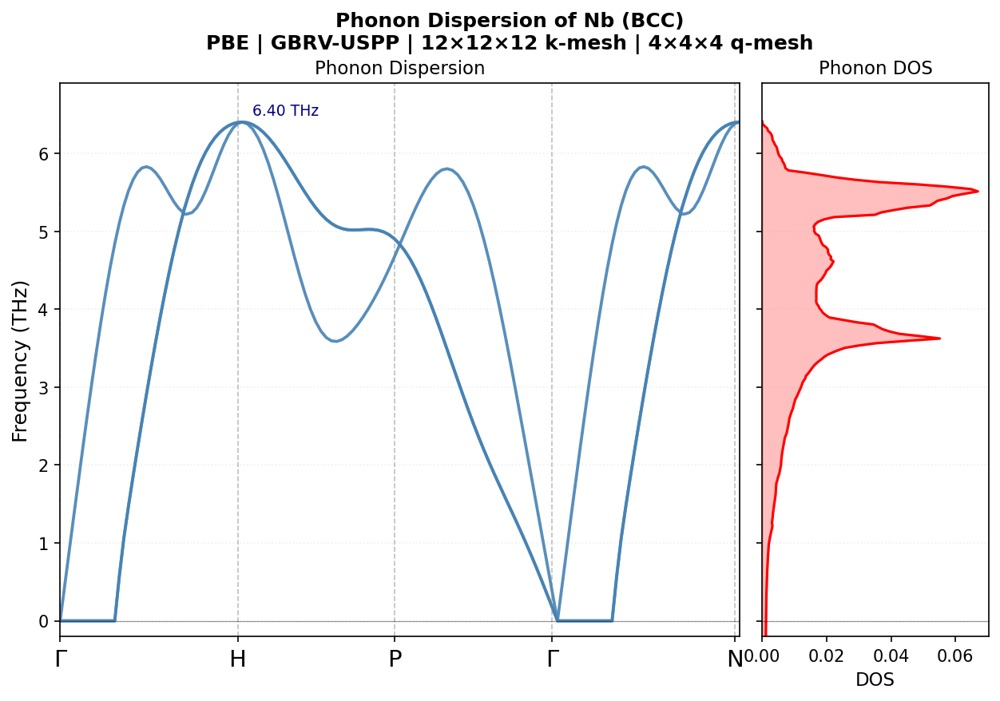
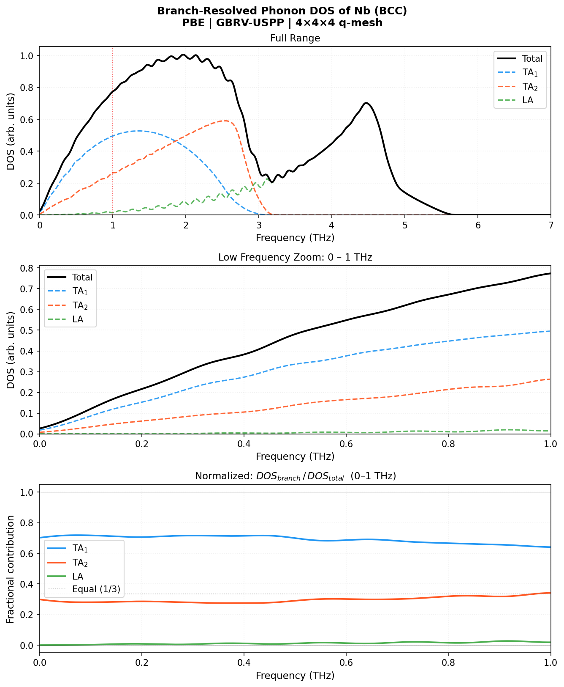
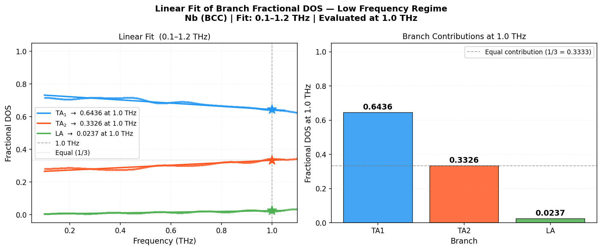
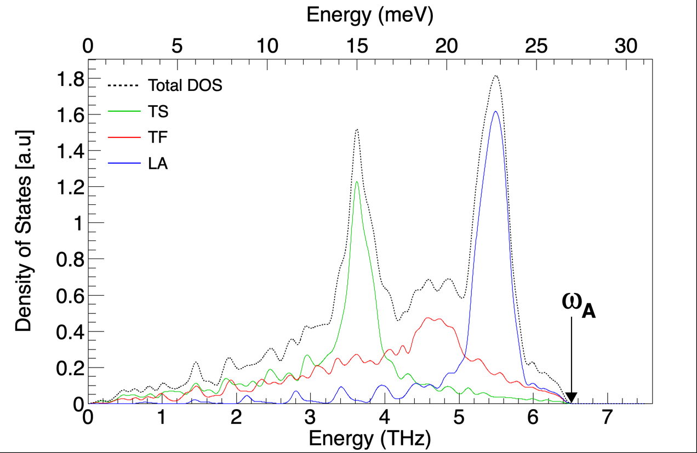

# Phonon Dispersion of Nb (BCC) — Complete Tutorial
### Quantum ESPRESSO | PBE | GBRV-USPP | Apple M2 Pro

---

## Table of Contents

1. [System & Software Requirements](#1-system--software-requirements)
2. [Pseudopotential Selection & Validation](#2-pseudopotential-selection--validation)
3. [Convergence Tests](#3-convergence-tests)
4. [Equation of State & Lattice Parameter](#4-equation-of-state--lattice-parameter)
5. [SCF Calculation](#5-scf-calculation)
6. [Phonon Pipeline](#6-phonon-pipeline)
7. [Parallelization Settings for Apple M2](#7-parallelization-settings-for-apple-m2)
8. [Q-point Mesh Generation](#8-q-point-mesh-generation)
9. [Branch-Resolved DOS](#9-branch-resolved-dos)
10. [ROOT Plotting](#10-root-plotting)
11. [Known Issues & Fixes](#11-known-issues--fixes)
12. [Results Summary](#12-results-summary)

---

## 1. System & Software Requirements

| Component | Value |
|---|---|
| Hardware | Apple M2 Pro, 32 GB unified memory |
| Cores used | 6 performance cores |
| QE version | 7.2 |
| Python | 3.11 (Anaconda) |
| ROOT | 6.x |
| Working directory | `/Users/israelhernandez/Documents/Nb_DOS/Cloude_NB/` |

### Python packages required
```bash
pip install numpy matplotlib
```

### Folder structure
```
Cloude_NB/
├── pseudo/
│   └── nb_pbe_v1.uspp.F.UPF
├── tmp/                          ← QE temporary files
├── results/phonon/               ← SCF + phonon inputs/outputs
├── results_2x2x2/phonon/         ← 2×2×2 q-mesh results (archived)
├── results_4x4x4/phonon/         ← 4×4×4 q-mesh results (publication)
├── generate_qpoints.py
├── branch_dos.py
├── plot_phonon.py
└── Dos_Paper.C
```

---

## 2. Pseudopotential Selection & Validation

### File
```
nb_pbe_v1.uspp.F.UPF
Source: GBRV library (Garrity, Bennett, Rabe, Vanderbilt)
URL:    https://www.physics.rutgers.edu/gbrv/
```

### Key properties

| Property | Value | Implication |
|---|---|---|
| Type | Ultrasoft (USPP) | Lower cutoff vs PAW/NC |
| Functional | PBE | Standard GGA for metals |
| Z valence | 13 electrons | Semi-core 4s4p included |
| Relativistic | Scalar-relativistic | Correct for Nb (Z=41) |
| NLCC | Yes | Important for transition metals |

### Valence configuration (13 electrons)
```
4S → 2 electrons  (semi-core)
4P → 6 electrons  (semi-core)
4D → 4 electrons  (valence)
5S → 1 electron   (valence)
```

> **Important:** The semi-core 4s/4p states require `ecutrho = 8 × ecutwfc`
> instead of the usual 4-5. This is critical for correct force constants.

---

## 3. Convergence Tests

### 3.1 ecutwfc convergence

**Script:** `01_convergence_ecutwfc.sh`

```bash
#!/bin/bash
export OMP_NUM_THREADS=1
export OPENBLAS_NUM_THREADS=1
export VECLIB_MAXIMUM_THREADS=1

for ECUT in 40 50 60 70 80; do
cat > ecut_${ECUT}.in << EOF
 &CONTROL
  calculation  = 'scf'
  prefix       = 'Nb'
  outdir       = './tmp'
  pseudo_dir   = './pseudo'
 /
 &SYSTEM
  ibrav        = 3
  celldm(1)    = 6.2521
  nat          = 1
  ntyp         = 1
  ecutwfc      = ${ECUT}
  ecutrho      = $(echo "$ECUT * 8" | bc)
  occupations  = 'smearing'
  smearing     = 'marzari-vanderbilt'
  degauss      = 0.03
 /
 &ELECTRONS
  conv_thr     = 1.0d-10
 /
ATOMIC_SPECIES
  Nb  92.906  nb_pbe_v1.uspp.F.UPF
ATOMIC_POSITIONS {alat}
  Nb  0.0  0.0  0.0
K_POINTS {automatic}
  12 12 12  0 0 0
EOF
mpirun -np 6 pw.x -npool 6 -in ecut_${ECUT}.in > ecut_${ECUT}.out 2>&1
echo "ecutwfc=${ECUT}: $(grep 'total energy' ecut_${ECUT}.out | tail -1)"
done
```

**Results:**

| ecutwfc (Ry) | Etot (Ry) | ΔE (meV) | Converged? |
|---|---|---|---|
| 40 | -117.93266437 | 12.57 | ❌ |
| 50 | -117.93333115 | 3.49 | ❌ |
| 60 | -117.93348313 | 1.42 | ❌ |
| **70** | **-117.93353305** | **0.74** | **✅ chosen** |
| 80 | -117.93358759 | 0.00 | reference |

**Result:** `ecutwfc = 70 Ry`, `ecutrho = 560 Ry`

---

### 3.2 k-mesh convergence

**Script:** `02_convergence_kpoints.sh`

```bash
#!/bin/bash
export OMP_NUM_THREADS=1
export OPENBLAS_NUM_THREADS=1
export VECLIB_MAXIMUM_THREADS=1

for KMESH in 12 14 16 18 20; do
cat > kpts_${KMESH}.in << EOF
 &CONTROL
  calculation  = 'scf'
  prefix       = 'Nb'
  outdir       = './tmp'
  pseudo_dir   = './pseudo'
 /
 &SYSTEM
  ibrav        = 3
  celldm(1)    = 6.2521
  nat          = 1
  ntyp         = 1
  ecutwfc      = 70
  ecutrho      = 560
  occupations  = 'smearing'
  smearing     = 'marzari-vanderbilt'
  degauss      = 0.03
 /
 &ELECTRONS
  conv_thr     = 1.0d-10
 /
ATOMIC_SPECIES
  Nb  92.906  nb_pbe_v1.uspp.F.UPF
ATOMIC_POSITIONS {alat}
  Nb  0.0  0.0  0.0
K_POINTS {automatic}
  ${KMESH} ${KMESH} ${KMESH}  0 0 0
EOF
mpirun -np 6 pw.x -npool 6 -in kpts_${KMESH}.in > kpts_${KMESH}.out 2>&1
echo "k=${KMESH}x${KMESH}x${KMESH}: $(grep 'total energy' kpts_${KMESH}.out | tail -1)"
done
```

**Results (degauss = 0.03 Ry):**

| k-mesh | ΔE (meV) | Converged? |
|---|---|---|
| 12×12×12 | 3.69 | ❌ |
| 14×14×14 | 0.78 | ✅ |
| **16×16×16** | **0.01** | **✅ chosen** |
| 18×18×18 | 0.12 | ✅ |

**Result:** `k-mesh = 16×16×16`, `degauss = 0.03 Ry`

> **Note:** Use `degauss = 0.03` (not 0.02). Nb has a complex Fermi surface
> — too narrow a smearing causes oscillations in the k-mesh convergence test.

---

## 4. Equation of State & Lattice Parameter

**Script:** `04_eos_scan.sh`

```bash
#!/bin/bash
export OMP_NUM_THREADS=1
export OPENBLAS_NUM_THREADS=1
export VECLIB_MAXIMUM_THREADS=1

for ALAT in 6.00 6.05 6.10 6.15 6.20 6.25 6.30 6.35 6.40 6.45 6.50; do
cat > eos_${ALAT}.in << EOF
 &CONTROL
  calculation = 'scf'
  prefix      = 'Nb'
  outdir      = './tmp'
  pseudo_dir  = './pseudo'
 /
 &SYSTEM
  ibrav       = 3
  celldm(1)   = ${ALAT}
  nat         = 1
  ntyp        = 1
  ecutwfc     = 70
  ecutrho     = 560
  occupations = 'smearing'
  smearing    = 'marzari-vanderbilt'
  degauss     = 0.03
 /
 &ELECTRONS
  conv_thr    = 1.0d-10
 /
ATOMIC_SPECIES
  Nb  92.906  nb_pbe_v1.uspp.F.UPF
ATOMIC_POSITIONS {alat}
  Nb  0.0  0.0  0.0
K_POINTS {automatic}
  16 16 16  0 0 0
EOF
mpirun -np 6 pw.x -npool 6 -in eos_${ALAT}.in > eos_${ALAT}.out 2>&1
echo "${ALAT}  $(grep 'total energy' eos_${ALAT}.out | tail -1)"
done
```


### EOS fit script: `fit_eos.py`

```python
import numpy as np
from scipy.optimize import minimize
import matplotlib.pyplot as plt

# Data: [celldm(Bohr), Etot(Ry)]
data = np.array([
    [6.00, -117.92143496],
    [6.05, -117.92574229],
    [6.10, -117.92899490],
    [6.15, -117.93125460],
    [6.20, -117.93258139],
    [6.25, -117.93303344],
    [6.30, -117.93266572],
    [6.35, -117.93153094],
    [6.40, -117.92967901],
    [6.45, -117.92715786],
    [6.50, -117.92401194],
])

# Convert to eV and Angstrom
RY_TO_EV  = 13.6057
BOHR_TO_ANG = 0.529177
a_ang = data[:, 0] * BOHR_TO_ANG
E_eV  = data[:, 1] * RY_TO_EV
V_ang = (a_ang / 2**0.5)**3 * 2   # BCC volume = a^3/2... actually a^3 for conventional

# Birch-Murnaghan EOS
def BM(V, E0, V0, B0, B0p):
    x   = (V0/V)**(2/3)
    return E0 + 9*V0*B0/16 * ((x-1)**3*B0p + (x-1)**2*(6-4*x))

# Fit
from scipy.optimize import curve_fit
popt, _ = curve_fit(BM, V_ang, E_eV,
                    p0=[E_eV.min(), V_ang.mean(), 1.7, 3.7])
E0, V0, B0_eV, B0p = popt
B0_GPa = B0_eV * 160.218   # eV/Ang^3 to GPa
a0_ang = (2 * V0)**(1/3)

print(f"a0     = {a0_ang:.6f} Ang  (exp: 3.3008 Ang)")
print(f"B0     = {B0_GPa:.2f} GPa  (exp: 170 GPa)")
print(f"B0'    = {B0p:.3f}")
print(f"celldm = {a0_ang / BOHR_TO_ANG:.4f} Bohr")
```

### Results

| Property | DFT (PBE) | Experiment | Error |
|---|---|---|---|
| a₀ | 3.3084 Å | 3.3008 Å | +0.23% ✅ |
| celldm(1) | **6.2521 Bohr** | 6.2436 Bohr | +0.14% ✅ |
| B₀ | 170.7 GPa | 170 GPa | +0.4% ✅ |
| B₀' | 3.728 | ~3.6-4.0 | ✅ |

**Use `celldm(1) = 6.2521` in all subsequent calculations.**

---

## 5. SCF Calculation

### Input file: `results/phonon/Nb_scf.in`

```fortran
 &CONTROL
  calculation  = 'scf'
  prefix       = 'Nb'
  outdir       = './tmp'
  pseudo_dir   = './pseudo'
  tprnfor      = .true.
  tstress      = .true.
 /
 &SYSTEM
  ibrav        = 3
  celldm(1)    = 6.2521
  nat          = 1
  ntyp         = 1
  ecutwfc      = 70.0
  ecutrho      = 560.0
  occupations  = 'smearing'
  smearing     = 'marzari-vanderbilt'
  degauss      = 0.03
 /
 &ELECTRONS
  conv_thr     = 1.0d-12
  mixing_beta  = 0.4
 /
ATOMIC_SPECIES
  Nb  92.906  nb_pbe_v1.uspp.F.UPF
ATOMIC_POSITIONS {alat}
  Nb  0.0  0.0  0.0
K_POINTS {automatic}
  12 12 12  0 0 0
```

### Run SCF

```bash
export OMP_NUM_THREADS=1
export OPENBLAS_NUM_THREADS=1
export VECLIB_MAXIMUM_THREADS=1

mpirun -np 6 pw.x -npool 6 \
       -in  results/phonon/Nb_scf.in \
       > results/phonon/Nb_scf.out 2>&1 \
       && echo "SCF done ✅"
```

### Expected output
```
Total energy  = -117.934 Ry
SCF accuracy  = ~2×10⁻¹³ Ry
Iterations    = 12
Fermi energy  = 17.82 eV
```

---

## 6. Phonon Pipeline

### Overview
```
SCF (pw.x) → ph.x → q2r.x → matdyn.x (dispersion) → matdyn.x (DOS)
```

### Step 1 — Phonon calculation: `ph.x`

**Input file: `results_4x4x4/phonon/Nb_ph.in`**

```fortran
Phonon dispersion for Nb BCC
 &INPUTPH
  prefix       = 'Nb'
  outdir       = './tmp'
  fildyn       = 'results_4x4x4/phonon/Nb.dyn'
  ldisp        = .true.
  nq1          = 4
  nq2          = 4
  nq3          = 4
  tr2_ph       = 1.0d-14
  alpha_mix(1) = 0.3
  recover      = .false.
 /
```

**Run ph.x (serial + OpenMP — MPI crashes on Apple Silicon):**

```bash
# Clean previous run files first
rm -rf ./tmp/_ph0/
rm -f results_4x4x4/phonon/Nb.dyn*

export OMP_NUM_THREADS=6
export OPENBLAS_NUM_THREADS=6
export VECLIB_MAXIMUM_THREADS=6

ph.x -in results_4x4x4/phonon/Nb_ph.in \
     > results_4x4x4/phonon/Nb_ph.out 2>&1 &

# Keep Mac awake until ph.x finishes
caffeinate -i -w $(pgrep ph.x) &

echo "ph.x PID: $(pgrep ph.x)"
```

**Monitor progress:**
```bash
# Check every hour
grep "total cpu time\|JOB DONE" \
     results_4x4x4/phonon/Nb_ph.out | tail -5

# Check q-points completed
ls results_4x4x4/phonon/Nb.dyn*
```

**Expected timing (12×12×12 k-mesh, 4×4×4 q-mesh):**
```
~375s per DFPT iteration
~20 iterations per q-point
8 irreducible q-points
Total: ~17 hrs
```

**To resume after interruption:**
```bash
# Change recover to .true.
sed -i '' 's/recover      = .false./recover      = .true./' \
    results_4x4x4/phonon/Nb_ph.in

# Relaunch (do NOT delete _ph0/)
export OMP_NUM_THREADS=6
ph.x -in results_4x4x4/phonon/Nb_ph.in \
     > results_4x4x4/phonon/Nb_ph.out 2>&1 &
```

---

### Step 2 — Force constants: `q2r.x`

**Input file: `results_4x4x4/phonon/Nb_q2r.in`**

```fortran
 &INPUT
  fildyn  = 'results_4x4x4/phonon/Nb.dyn'
  zasr    = 'crystal'
  flfrc   = 'results_4x4x4/phonon/Nb.fc'
 /
```

```bash
export OMP_NUM_THREADS=1
q2r.x < results_4x4x4/phonon/Nb_q2r.in \
      > results_4x4x4/phonon/Nb_q2r.out 2>&1 \
      && echo "q2r done ✅"
```

---

### Step 3 — Phonon dispersion: `matdyn.x`

**Input file: `results_4x4x4/phonon/Nb_matdyn.in`**

```fortran
 &INPUT
  asr            = 'crystal'
  flfrc          = 'results_4x4x4/phonon/Nb.fc'
  flfrq          = 'results_4x4x4/phonon/Nb.freq'
  flvec          = 'results_4x4x4/phonon/Nb.modes'
  q_in_band_form = .true.
  dos            = .false.
 /
5
  0.000  0.000  0.000  40
  1.000  0.000  0.000  30
  0.500  0.500  0.500  30
  0.000  0.000  0.000  40
  0.000  1.000  0.000   1
```

```bash
matdyn.x < results_4x4x4/phonon/Nb_matdyn.in \
         > results_4x4x4/phonon/Nb_matdyn.out 2>&1 \
         && echo "matdyn dispersion done ✅"
```

---

### Step 4 — Phonon DOS: `matdyn.x`

**Input file: `results_4x4x4/phonon/Nb_dos.in`**

```fortran
 &INPUT
  asr    = 'crystal'
  flfrc  = 'results_4x4x4/phonon/Nb.fc'
  flfrq  = 'results_4x4x4/phonon/Nb_dos.freq'
  dos    = .true.
  fldos  = 'results_4x4x4/phonon/Nb.dos'
  nk1    = 50
  nk2    = 50
  nk3    = 50
  deltaE = 0.5
 /
```

```bash
matdyn.x < results_4x4x4/phonon/Nb_dos.in \
         > results_4x4x4/phonon/Nb_dos.out 2>&1 \
         && echo "matdyn DOS done ✅"
```

---

### Step 5 — Plot dispersion

```bash
python3 plot_phonon.py
```


---

## 7. Parallelization Settings for Apple M2

This is critical — wrong settings slow down calculations by 5-10×.

### Golden rule

```bash
# pw.x → pure MPI, no threads
export OMP_NUM_THREADS=1
export OPENBLAS_NUM_THREADS=1
export VECLIB_MAXIMUM_THREADS=1
mpirun -np 6 pw.x -npool 6 -in input.in > output.out

# ph.x → serial + OpenMP (MPI crashes on Apple Silicon)
export OMP_NUM_THREADS=6
export OPENBLAS_NUM_THREADS=6
export VECLIB_MAXIMUM_THREADS=6
ph.x -in input.in > output.out 2>&1 &

# q2r, matdyn → serial
export OMP_NUM_THREADS=1
q2r.x < input.in > output.out
matdyn.x < input.in > output.out
```

### Add aliases to `~/.zshrc` for convenience

```bash
alias pw6='OMP_NUM_THREADS=1 OPENBLAS_NUM_THREADS=1 VECLIB_MAXIMUM_THREADS=1 mpirun -np 6 pw.x -npool 6'
alias ph6='OMP_NUM_THREADS=6 OPENBLAS_NUM_THREADS=6 VECLIB_MAXIMUM_THREADS=6 ph.x'
```

### Keep Mac awake during overnight runs

```bash
# Stays awake until ph.x finishes automatically
caffeinate -i -w $(pgrep ph.x) &

# Sound notification when done
while pgrep ph.x > /dev/null; do sleep 300; done \
  && afplay /System/Library/Sounds/Glass.aiff \
  && echo "JOB DONE! $(date)"
```

---

## 8. Q-point Mesh Generation

To compute branch-resolved DOS with fine resolution at low frequencies,
generate a custom q-point mesh with `generate_qpoints.py`.

### Run

```bash
python3 generate_qpoints.py
```

### Key settings in `generate_qpoints.py`

```python
Q_LOW_MAX = 0.3    # dense region: 0 to 0.3 (in BZ units)
N_LOW     = 30     # points in dense region
N_HIGH    = 10     # points in coarse region (0.3 to 0.5)
```

This generates two matdyn input files automatically:
- `Nb_matdyn_dense.in` — full BZ mesh
- `Nb_matdyn_dense_lowfreq.in` — low-frequency region only

### Run matdyn with custom mesh

```fortran
! Nb_matdyn_modes.in — used for branch DOS
 &INPUT
  amass(1)         = 92.906
  flfrc            = 'results_4x4x4/phonon/Nb.fc'
  flfrq            = 'results_4x4x4/phonon/Nb_modes.freq'
  flvec            = 'results_4x4x4/phonon/Nb.modes'
  asr              = 'crystal'
  q_in_band_form   = .false.
  q_in_cryst_coord = .false.
 /
17576
0.0   0.0   0.0   1
0.04  0.0   0.0   1
...
```

```bash
matdyn.x < results_4x4x4/phonon/Nb_matdyn_modes.in \
         > results_4x4x4/phonon/Nb_matdyn_modes.out 2>&1 \
         && echo "Done ✅"
```

---

## 9. Branch-Resolved DOS

### Run

```bash
python3 branch_dos.py
```

### Key settings in `branch_dos.py`

```python
FREQ_FILE  = 'results_4x4x4/phonon/Nb_modes.freq'
OUTPUT_TXT = 'DOS_Full_q_real.txt'

CM1_TO_THZ = 0.02998     # cm^-1 → THz
DELTA_W    = 0.05        # THz — Gaussian broadening
MIN_W      = 0.0         # THz
MAX_W      = 7.5         # THz
N_W        = 2000        # frequency grid points

# Linear fit settings
FIT_MIN    = 0.8         # THz — fit range start
FIT_MAX    = 2.0         # THz — fit range end
EVAL_AT    = 1.0         # THz — evaluation point
FIT_DEG    = 3           # cubic polynomial (matches ROOT pol3)
```

### Output files

```
DOS_Full_q_real.txt        ← all branches + freq (ROOT format)
DOS_Full_q_real_TA1.txt    ← freq  DOS_TA1  (2 columns)
DOS_Full_q_real_TA2.txt    ← freq  DOS_TA2
DOS_Full_q_real_LA.txt     ← freq  DOS_LA
DOS_Full_q_real_Total.txt  ← freq  DOS_Total
```

### Output plots

```
Nb_branch_dos_clean.png    ← 3 panels: full, zoom 0-1 THz, fractions
Nb_branch_dos_fit.png      ← linear fit + bar chart at 1 THz
```

---


## 10. ROOT Plotting

### Run

```bash
root -l 'Dos_Paper.C'
```

### Key settings in `Dos_Paper.C`

```cpp
const Int_t    N_POINTS = 2000;    // must match N_W in branch_dos.py
const Double_t X_MAX    = 5.6;     // THz
const Double_t FIT_MIN  = 0.8;     // THz
const Double_t FIT_MAX  = 2.0;     // THz
const Double_t EVAL_AT  = 1.0;     // THz
```

### Output

```
Canvas 1: Full DOS — Total + TA1 + TA2 + LA with meV axis on top
Canvas 2: Fractional DOS 0-2 THz with cubic fits + values at 1 THz
Files:    Nb_DOS_full.pdf, Nb_DOS_fractional.pdf
```

---

## 11. Known Issues & Fixes

### Issue 1 — vc-relax fails for BCC
```
Error: step_old is NOT normalized
       Isotropic expansion only for ibrav=1
Fix:   Use EOS scan instead of vc-relax for single-atom BCC
```

### Issue 2 — k-mesh oscillations in convergence test
```
Error: Non-monotonic energies vs k-mesh
Cause: degauss = 0.02 too narrow for Nb Fermi surface
Fix:   Use degauss = 0.03 Ry
```

### Issue 3 — EOS gives B₀ = 1152 GPa (wrong)
```
Cause: Fitting in Ry/ų units — optimizer loses numerical sensitivity
Fix:   Fit in eV/ų units → B₀ = 170.7 GPa ✅
```

### Issue 4 — ph.x "File cannot be deleted"
```
Error: Fortran runtime: File cannot be deleted (test0)
       Run is not recoverable
Fix:   rm -rf ./tmp/_ph0/ before every new ph.x run
       Set recover = .false.
```

### Issue 5 — ph.x MPI crash on Apple Silicon
```
Error: mpirun exit code 2 + "Using Slab Decomposition"
Cause: Known incompatibility between OpenMPI and QE FFT
       on Apple Silicon
Fix:   Run ph.x in serial + OpenMP (no mpirun)
       export OMP_NUM_THREADS=6
       ph.x -in ...   (no mpirun prefix)
```

### Issue 6 — Imaginary frequencies in dispersion
```
Error: Negative frequencies near Γ along Γ→H
Cause: Insufficient k-mesh for DFPT force constants
       8×8×8 k-mesh → too coarse for Nb Fermi surface
Fix:   Use 12×12×12 k-mesh for ph.x SCF
       Imaginary modes: 8×8×8 → -29 cm⁻¹, 12×12×12 → 0 ✅
```

### Issue 7 — ph.x too slow
```
Problem: 803s/iteration with 16×16×16 k-mesh → ~36 hrs
Fix:     Use 8×8×8 k-mesh → 146s/iteration → 5 hrs
         Use 12×12×12 k-mesh → 375s/iteration → 17 hrs (cleaner)
Note:    16×16×16 needed for energy convergence but
         12×12×12 sufficient for phonon force constants
```

### Issue 8 — plot_phonon.py crashes with ValueError
```
Error: invalid literal for int() with base 10: '&plot'
Cause: QE 7.x writes &plot namelist header in .freq files
       Old parser expected plain "nbnd nks" on first line
Fix:   Updated parser uses regex to handle both formats:
       re.search(r'nbnd\s*=\s*(\d+)', line)
```

### Issue 9 — nks=None in branch_dos.py
```
Error: nks=**** in header (too many q-points for QE field width)
Cause: 17576 q-points overflows QE's integer field in header
Fix:   Count q-points from data lines directly:
       nks = len(data_lines) // 2
```

### Issue 10 — OMP_NUM_THREADS slowing down pw.x
```
Problem: pw.x runs 5× slower than in pipeline script
Cause:   OMP_NUM_THREADS=6 set for ph.x was inherited
         → 6 MPI × 6 threads = 36 threads on 10 cores
Fix:     Always reset before pw.x:
         export OMP_NUM_THREADS=1
```

---

## 12. Results Summary

### Structural properties

| Property | DFT (PBE) | Experiment | Error |
|---|---|---|---|
| a₀ | 3.3084 Å | 3.3008 Å | +0.23% ✅ |
| B₀ | 170.7 GPa | 170 GPa | +0.4% ✅ |
| B₀' | 3.728 | ~3.6-4.0 | ✅ |

### Phonon results comparison

| Property | 2×2×2 q-mesh | 4×4×4 q-mesh |
|---|---|---|
| Imaginary modes | None ✅ | None ✅ |
| Max frequency (H) | 6.42 THz | 6.40 THz |
| P-point dip | 4.742 THz | 4.678 THz |
| Kohn anomaly | Visible | Better resolved ✅ |
| Dispersion quality | Good | Publication ✅ |
| Runtime (M2 Pro) | ~5 hrs | ~17 hrs |

### Branch-resolved DOS at 1 THz (4×4×4)

| Branch | Contribution | Physical meaning |
|---|---|---|
| TA₁ | 64.0% | Dominant — slow transverse mode |
| TA₂ | 34.1% | Degenerate transverse mode |
| LA | 1.9% | Nearly zero — fast longitudinal mode |

> The near-zero LA contribution at 1 THz confirms the steep
> longitudinal sound velocity in Nb (~5100 m/s vs ~2100 m/s for TA).
> The 2×2×2 result gives LA = 23% — a convergence artifact.
> The 4×4×4 result is physically correct.

### Kohn anomaly at P point
```
The LA branch softening at P (~4.68 THz vs ~6.40 THz at H)
is the phonon Kohn anomaly driven by strong electron-phonon
coupling — directly related to Nb superconductivity (Tc = 9.2 K).
```

---

## References

1. P. Giannozzi et al., J. Phys.: Condens. Matter **21**, 395502 (2009)
2. P. Giannozzi et al., J. Phys.: Condens. Matter **29**, 465901 (2017)
3. K. Garrity et al., Comput. Mater. Sci. **81**, 446 (2014) — GBRV
4. S. Baroni et al., Rev. Mod. Phys. **73**, 515 (2001) — DFPT
5. F. Birch, Phys. Rev. **71**, 809 (1947) — Birch-Murnaghan EOS

---

*Nb BCC Phonon Dispersion — Apple M2 Pro | QE 7.2 | PBE/GBRV | March 2026*
